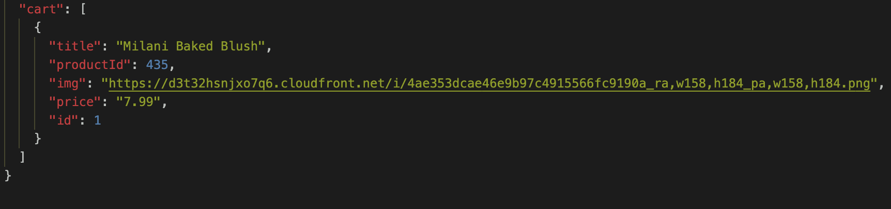

# BEAUTY MART - A Single Page Application in JS

## Demo

Here is a working live demo:
[Youtube](https://youtu.be/rHFJRz0TAOE)

## About
This SPA provides Online Shopping Experience, a user can search for the items they are looking for and can also shop for them.

## Installation

This application uses Free PUBLIC API for makeup products and also uses JSON Server to store reviews and cart items

### Install JSON Server

```npm install -g json-server```

### Start JSON Server

```json-server --watch db.json```

### Free Public API
[API LINK](https://makeup-api.herokuapp.com/api/v1/products.json)

## How it looks when the items get added to cart in JSON SERVER



